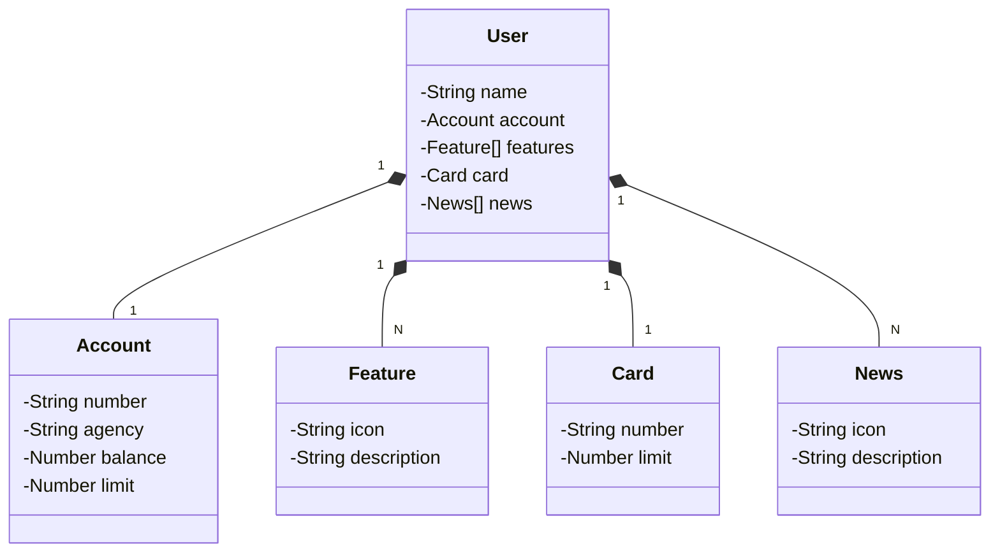

# API RESTful Java com PostgresSQL e Railway

RESTful API com postgresql construída em Java 21 com Spring Boot 3.3

## Principais Tecnologias
 - **Java 21**: Utilizaremos a versão LTS mais recente do Java para tirar vantagem das últimas inovações que essa linguagem robusta e amplamente utilizada oferece;
 - **Spring Boot 3.3**: Trabalharemos com a mais nova versão do Spring Boot, que maximiza a produtividade do desenvolvedor por meio de sua poderosa premissa de autoconfiguração;
 - **Spring Data JPA**: Exploraremos como essa ferramenta pode simplificar nossa camada de acesso aos dados, facilitando a integração com bancos de dados SQL;
 - **OpenAPI (Swagger)**: Vamos criar uma documentação de API eficaz e fácil de entender usando a OpenAPI (Swagger), perfeitamente alinhada com a alta produtividade que o Spring Boot oferece;
 - **Railway**: facilita o deploy e monitoramento de nossas soluções na nuvem, além de oferecer diversos bancos de dados como serviço e pipelines de CI/CD.

## 💻 [Link do Figma](https://www.figma.com/file/0ZsjwjsYlYd3timxqMWlbj/SANTANDER---Projeto-Web%2FMobile?type=design&node-id=1421%3A432&mode=design&t=6dPQuerScEQH0zAn-1)

O Figma foi utilizado para a abstração do domínio desta API, sendo útil na análise e projeto da solução.

## Diagrama de Classes (Domínio da API)



## 🤔 Como eu posso implementar o Postgres no Spring com Railway?

#### Criar um banco de dados PostgresSQL no Railway e configurar no projeto: 

1. **Acesse sua conta no Railway**
  - Vá para: [Railway]( https://railway.app)
  - Faça login com sua conta (GitHub ou email)

2. **Crie um novo projeto**
  - Clique em **'New projects'**
  - Escolha a opção **'Provision PostgresSQL'**

3. **Acesse as variáveis de ambiente**
  - Depois de provisionado, clique no banco e vá em **'Variables'**
  - Copie os valores das seguintes variáveis:
    - `PGHOST`
    - `PGPORT`
    - `PGDATABASE`
    - `PGUSER`
    - `PGPASSWORD`
    - `DATABASE_PUBLIC_URL`

4. **Configuração no projeto**

Use os dados acima na aplicação. Exemplo para Spring Boot com .properties
```
#Usei como base de dados o PGHOST_PUBLIC e PGPORT_PUBLI do: DATABASE_PUBLIC_URL
spring.datasource.url=jdbc:postgresql://${PGHOST_PUBLIC}:${PGPORT_PUBLIC}/${PGDATABASE}
spring.datasource.username=${PGUSER}
spring.datasource.password=${PGPASSWORD}

spring.datasource.driver-class-name=org.postgresql.Driver
spring.jpa.hibernate.ddl-auto=update
spring.jpa.show-sql=true
spring.jpa.properties.hibernate.dialect=org.hibernate.dialect.PostgreSQLDialect
```

 - **Atenção**: No projeto criei um `application-prod.properties` para colocar as configurações de produção. Para indicar qual *.properties* deve ser usado na aplicação coloque a seguinte variável no IntelliJ `SPRING_PROFILES_ACTIVE=prod`
 
5. **Configurar as *Environment Variables* da aplicação**
  - No seu IntelliJ configure as seguintes variáveis:
      - `SPRING_PROFILES_ACTIVE=prod`
      - `PGHOST_PUBLIC=gondola.proxy.rlwy.net`
      - `PGPORT_PUBLIC=1234`
      - `PGUSER=userX`
      - `PGPASSWORD=kasasasasasasasRERRR`
      - `PGDATABASE=railway`

## 🚀 Como eu posso realizar deploy da minha aplicação usando Dockerfile?

1. **Crie um arquivo Dockerfile**
 - Na raiz do seu projeto, crie um arquivo Dockerfile
 - Usando como base a documentação do [Railway doc](https://docs.railway.com/guides/spring-boot#use-a-dockerfile), copie o Dockerfile e altere a permissão de acesso ao *Maven Wrapper*:
 ```
#Use the Eclipse temurin alpine official image
# https://hub.docker.com/_/eclipse-temurin
FROM eclipse-temurin:21-jdk-alpine

#Create and change to the app directory.
WORKDIR /app

#Copy local code to the container image.
COPY . ./

#Permissão para executar o comando ./mvnw
RUN chmod +x ./mvnw

#Executo o Maven Wrapper pra compilar o projeto
RUN ./mvnw -DoutputFile=target/mvn-dependency-list.log -B -DskipTests clean dependency:list install

#Run the app by dynamically finding the JAR file in the target directory
CMD ["sh", "-c", "java -jar target/*.jar"]
 ```

 - Suba a aplicação no seu repositório do GitHub

2. **Acesse sua conta no Railway, novamente**
 - Acesse [Railway]( https://railway.app)
 - Faça login com sua conta (GitHub ou email)

3. **Crie um novo projeto**
  - Clique em **'New projects'**
  - Escolha a opção **'Deploy from GitHub Repo'**
  - Autorize o Railway a acessar seu repositório

4. **Condigurações iniciais para as variáveis do deploy**
 - Vá para **'Settings'** e na aba **'Networking'** adicione uma nova *Public Networking* clicando em **'Custom Domain'*
 - Coloque a porta como 8080
 - Altere o nome, opcional (Exemplo: api-teste-git)

5. **Adicionei uma Shared Variable**
 - No projeto, selecione a opção **'Settings'**, no canto superior direito
 - Vá até: **'Shared Variables'"** e adicione o *Profile* do seu projeto, no caso **'prod'**, configurado anteriormente (Configuração no projeto)
 - Adicione:  `SPRING_PROFILES_ACTIVE = prod`

6. **Adicionar as variáveis ao GitHub Deploy**
 - Voltei para o card do GitHub deploy e vá até a opção: **'Variables'**
 - Adicione as variáveis do passo **Configurar as *Environment Variables* da aplicação** 
 - Selecione a opção **'Shared Variable'** e adicione o *Profile* configurado anteriormente.

7. **Teste**
 - Certifique-se de que o deploy foi realizado com sucesso
 - Vá até o Swagger da aplicação disponibilizada no deploy (URL de conexão disponível em **'Settings'** -> **'Public Networking'**): https://api-teste-git.up.railway.app/swagger-ui/index.html#/


## 📚 Documentação da API (Swagger)

### [https://sdw-2023-prd.up.railway.app/swagger-ui.html](https://sdw-2023-prd.up.railway.app/swagger-ui.html)

Esta API ficará disponível no Railway por um período de tempo limitado, mas este é um código-fonte aberto. Portanto, sintam-se à vontade para cloná-lo, modificá-lo (já que é um bom projeto base para novos projetos) e executar localmente ou onde achar mais interessante! Só não esquece de marcar a gente quando divulgar a sua solução 🥰

### ‼️IMPORTANTE

Aos interessados no desenvolvimento da tela inicial do App do Santander (Figma) em Angular, Android, iOS ou Flutter... Caso a URL produtiva não esteja mais disponível, deixamos um Backup no GitHub Pages, é só dar um GET lá 😘
- URL de Produção: https://sdw-2023-prd.up.railway.app/users/1
- Mock (Backup): https://digitalinnovationone.github.io/santander-dev-week-2023-api/mocks/find_one.json


## 🔗 Links
[](https://www.linkedin.com/in/nikson-hernandes-55492b207/)
